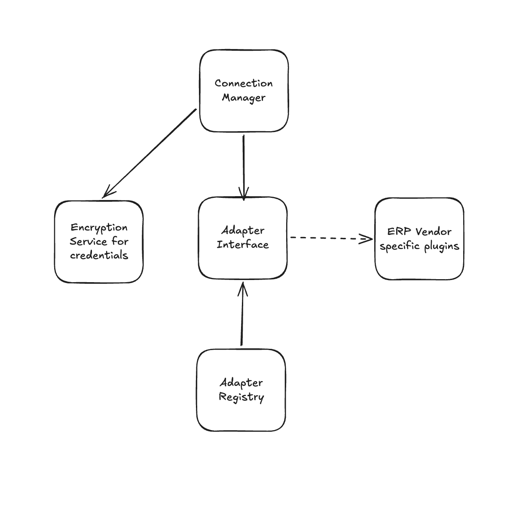

# Architecture

## Product Vision & Data Strategy

The core focus of this tool is the accountant's workflow by providing an unified view across clients using different ERP systems, which removes the need to jump between platforms. 

The platform also uses a hybrid approach to data management.

1. **Runtime Queries:** Financial data (Invoices, Contacts, Accounts, Journals and Payments) is fetched directly from the ERP per request. This guarantees data freshness and avoids the complexity and liability of syncing a full data lake.
2. **Lightweight Cached Composites:** Dashboard metrics (Total AR/AP, Cash Position, Overdue) are computed and cached in the database. This keeps the dashboard responsive while minimizing API hits and rate-limiting issues. If data is more than 15 minutes old, consider it stale. We also got a cron job that refreshes the cache every day (due to vercel free plan limitations).
3. **Secure Token Storage:** All integration credentials and OAuth tokens are AES-256 encrypted at rest.

## Canonical Data Model

Downstream ERP data is mapped into a normalized canonical model, so the accountant sees a universal language.

- **CanonicalInvoice:** Unifies Sales Invoices (AR) and Purchase Invoices (AP).
- **CanonicalContact:** Combines Customers and Suppliers.
- **CanonicalAccount:** Standardizes Chart of Accounts representations.
- **CanonicalJournalEntry:** Standardizes ledger data structures.
- **CanonicalPayment:** Represents cash movements across platforms (Only xero atm. Other platforms are marked as unsupported).

### Tradeoffs
- **Loss of Granularity:** Certain ERP-specific fields are dropped when normalizing to preserve the simplicity. These can be added into the canonical interfaces later if required.
- **Pagination & Record Limits:** We currently limit the number of records fetched per request (hardcoded row counts in adapters), which can affect data accuracy (ex: in `getMetrics()` calculation) for high-volume accounts as they won't retrieve the full dataset.
- **Intentional Avoidance of Full Sync / Data Lake:** Tradeoffs involved in avoiding a local data warehouse and have made this a deliberate choice to keep the system lightweight, fresh and secure.

## Adapter Architecture

The integration layer relies on a loosely coupled adapter pattern, allowing new ERP integrations to be plugged in with minimal effort without hardcoding ERP-specific logic in the UI.

### Adding a New ERP
To add a new integration (e.g., Procountor), developers implement the `IErpAdapterPlugin` interface:

1. **`metadata`**: Provider name, icon, and auth requirements.
2. **`auth`**: The `authenticate` method to manage token exchanges and refreshes.
3. **Data Fetchers**: Implement `invoices`, `contacts`, `accounts`, `journals`, and `payments`.
4. **`dashboard`**: Implement `getMetrics` for high-level aggregated data.

Once registered in `src/lib/erp/adapters/AdapterRegistry.ts`, the new ERP is automatically supported by the underlying API, Connection Manager, and UI.

## Security & Compliance

- **Token Storage:** Credentials (OAuth tokens, API keys) are encrypted before persisting using AES-256 (using `crypto-js` lib).
- **Key Rotation:** Expiring tokens are detected automatically during API calls. The adapter handles token refreshes in the background, recovering seamlessly. If the refresh flow irrevocably fails, it securely marks the connection as needing re-authorization.
- **Data Minimization (GDPR):** By utilizing runtime queries instead of syncing whole databases, the platform severely limits the amount of stored PII. We hold lightweight composites instead of logging every individual invoice's customer data, heavily reducing our GDPR footprint.

## Resilience & Scalability

Since the dashboard is scoped per-client (where each client maps to exactly one ERP connection), the frontend doesn't attempt to fetch multiple clients concurrently. This prevents single-request bottlenecks and overwhelming API calls on load.

- **Optional Interfaces (Capability Gaps):** Some features in `IErpAdapterPlugin` are optional. If an ERP lacks a Payments API, the adapter omits it and the platform falls back gracefully, showing empty states rather than breaking.
- **Rate Limiting & Retries:** Vendor-specific rate limits are handled via a centralized API client utility using Axios interceptors, enabling retry with backoff for 429 errors. If retries are exhausted, the utility will `return Promise.reject(new ErpRateLimitError());` to ensure a consistent error experience across all adapters.

## Project Scope & Limitations

- **No User Authentication:** The platform currently lacks a user-facing authentication system. The primary technical focus of this iteration is building and proving out the loosely coupled adapter architecture and ensuring seamless integrations with various ERP systems, rather than building user management flows.

## Future Explorations

### Artificial Intelligence Strategy
If we add computationally heavy AI features like "Find anomalies across all clients," our current purely runtime-query strategy will face latency to fetch data from all clients. We would need to change our storage strategy towards a data warehouse.

### Webhooks
We deliberately did not implement webhooks in production at this stage because the required data could be sufficiently and reliably retrieved from the REST endpoints. That said, I've experimented with and successfully tested webhook subscriptions (e.g., Tripletex for events like `invoice.charged`). The webhook payload correctly delivers all expected data when an invoice is created and charged. This event-driven approach has been proven to work and can be implemented in the future if the platform requires real-time push updates instead of relying solely on runtime queries.
